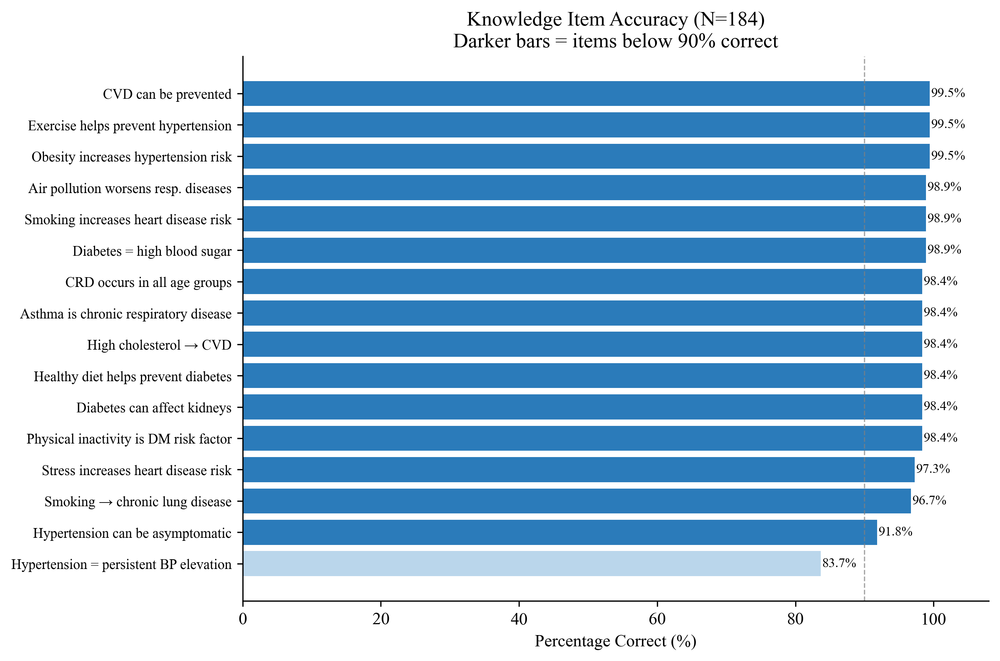
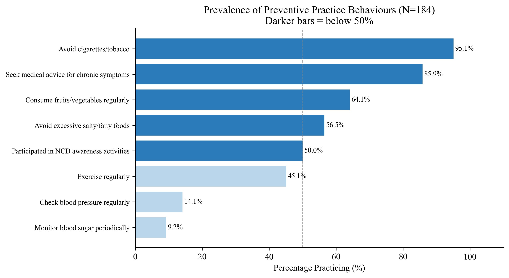
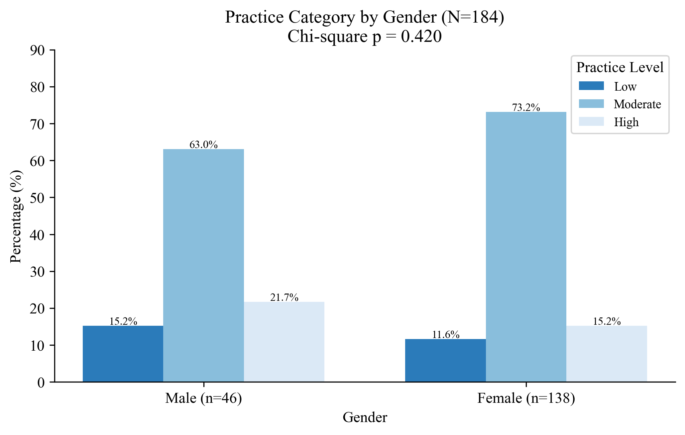

# NCD Knowledge, Attitudes, and Practices Among Medical Students — University of Gezira

## Gezira State, Sudan – 2026

**Study type:** Cross-sectional, institution-based descriptive study

**Degree level:** Clinical Master Degree in Family Medicine (Sudan Medical Specializations Board)

**Institution:** Faculty of Medicine, University of Gezira, Wad Madani, Gezira State

**Sample size:** N = 184 undergraduate medical students (Batches 44 & 45)

**Data analyst:** Abdulrahman Sirelkhatim

---

## Background

Non-communicable diseases (NCDs) — principally cardiovascular diseases, diabetes mellitus,
chronic respiratory diseases, and cancers — account for approximately 41 million deaths
annually, representing 74% of all global mortality. In Sudan, roughly 24% of total deaths
are attributable to NCDs, a burden compounded by urbanization, unhealthy dietary patterns,
physical inactivity, and severely limited preventive healthcare infrastructure.

Medical students are the next generation of clinicians, health educators, and public health
advocates. Their knowledge of NCD risk factors, attitudes toward prevention, and personal
preventive behaviors have direct implications for how they will counsel patients and
communities throughout their careers. A well-documented gap exists between theoretical
knowledge and actual health behavior in this population — students frequently demonstrate
high awareness while practicing fewer preventive behaviors themselves.

The University of Gezira is one of Sudan's largest public universities, with a
community-oriented medical curriculum and a student population drawn from both urban and
rural Gezira State. Despite the increasing NCD burden nationally, no published study had
previously characterized NCD knowledge, attitudes, and practices specifically among its
medical students. This study provides that baseline.

## Objectives

- Evaluate the level of awareness of common NCDs (hypertension, diabetes mellitus,
cardiovascular diseases, and chronic respiratory diseases) among medical students
- Assess the frequency and types of preventive practice behaviors for NCDs
- Identify sociodemographic and informational factors associated with awareness and
preventive behavior
- Explore the association between knowledge, attitude, and practice levels
- Provide evidence-based recommendations for improving NCD awareness and preventive
behaviors among medical students

## Study Design & Methods

| Component | Detail |
|-----------|--------|
| Design | Cross-sectional, institution-based descriptive |
| Setting | University of Gezira, Faculty of Medicine, Wad Madani |
| Population | Undergraduate medical students, Batches 44 & 45 (N = 350) |
| Sampling | Stratified random sampling with proportional allocation by academic year |
| Sample size calculation | Cochran's formula + finite population correction → n = 184 |
| Data collection | Structured self-administered questionnaire (March–June 2026) |

**Instrument structure:**

| Section | Items | Scale | Score range |
|---------|-------|-------|-------------|
| Knowledge (K) | 16 True/False items | Correct = 1, Incorrect = 0 | 0–16 |
| Attitude (A) | 8 Likert items | Strongly Disagree=1 to Strongly Agree=5 | 8–40 |
| Practice (P) | 8 Yes/No items | Yes = 1, No = 0 | 0–8 |

**Scoring cut-offs:**

| Domain | Poor / Negative / Low | Fair / Neutral / Moderate | Good / Positive / High |
|--------|----------------------|--------------------------|------------------------|
| Knowledge | 0–8 | 9–12 | 13–16 |
| Attitude | 8–18 | 19–29 | 30–40 |
| Practice | 0–2 | 3–5 | 6–8 |

**Technical suite:**

| Tool | Purpose |
|------|---------|
| Python (pandas, re) | Data cleaning, Arabic text removal, score computation, binary variable creation |
| IBM SPSS Statistics v26 | Full statistical analysis |
| Python (matplotlib, seaborn) | Figure generation |
| Jupyter Notebook | Exploratory data analysis |

**Statistical methods:**

- **Reliability:** KR-20 equivalent (SPSS RELIABILITY/ALPHA on binary items) for Knowledge and Practice;
Cronbach's Alpha for Attitude
- **Descriptive:** Frequencies, percentages, means, SDs
- **Bivariate:** Chi-square tests (Fisher's Exact where expected cell count < 5); Knowledge and
Attitude collapsed to binary for bivariate analysis due to severe ceiling effects
- **Mean comparisons:** Independent samples t-test (Gender, Residence); one-way ANOVA with
Tukey HSD post-hoc (Family History)
- **Multivariate:** Binary logistic regression (predictors of adequate preventive practice);
Enter method; outcome = P_High (Practice Category = High vs Low/Moderate)

## Dataset

| File | Description |
|------|-------------|
| `1_data/raw/raw_data.xlsx` | Raw bilingual (Arabic/English) Google Form export |
| `1_data/cleaned/cleaned_data.xlsx` | Cleaned dataset: numeric-coded demographics, binary source variables, scored KAP items, total scores, 3-level categories, binary collapsed categories (K_Cat2, A_Cat2), and P_High binary outcome |

> **Privacy note:** Raw data is excluded from version control. The cleaned file retains no
individual identifiers; participant IDs are sequential integers assigned after random sampling.

> **Sampling note:** The raw dataset contains all collected responses. During the cleaning process, `cleaning.py` draws
a sample of **n = 184** using `pandas.DataFrame.sample()` with `random_state=42` to match the study's calculated sample
size. The fixed seed ensures reproducibility and will produce the same sample on every run unless the seed is changed.

## Repository Structure

```text
ncd-kap-ugezira-2026/
│
├── README.md
├── .gitignore
├── .ls-lint.yml
├── .markdownlint.yml
├── .markdownlintignore
│
├── 1_data/
│   ├── raw/                        ← excluded from version control (privacy)
│   └── cleaned/
│       └── cleaned_data.xlsx
│
├── 2_cleaning/
│   └── cleaning.py
│
├── 3_notebooks/
│   └── exploratory_analysis.ipynb
│
├── 4_analysis/
│   ├── full_analysis.sps
│   └── figures.py
│
├── 5_figures/
│   └── (12 figures)
│
└── 6_docs/
    └── results_chapter.docx
```

## Key Results

### Scale Reliability

- Knowledge (KR-20): not separately reported due to near-zero item variance (>96% correct on
14 of 16 items); the scale performed as expected for a cohort in clinical training
- Attitude Cronbach's Alpha: **0.743**, indicating acceptable internal consistency
- Practice KR-20: not reported; items showed useful variance across the full range

### Demographic Profile

The sample was predominantly female (75.0%), aged 20–24 years (95.7%), and in their third
academic year (97.8%), reflecting the composition of the two batches sampled. Nearly all
participants were single (98.4%) and from urban residences (70.1%). A majority (59.8%)
reported a family history of NCDs; 6.0% were unsure of their family history.

The medical curriculum was the most frequently cited source of NCD information (83.7%),
followed by the internet (54.3%) and social media (48.9%). Formal structured channels such
as workshops and seminars were reported by only 13.0% of participants.

### Knowledge of NCDs

Knowledge was exceptionally high, with a mean score of **15.55 ± 0.91** out of 16, and **98.9%
of participants classified as Good** (score 13–16). Fifteen of 16 items were answered correctly
by more than 90% of participants. The only notable gap was the clinical definition of
hypertension (K01: 83.7% correct), suggesting that while students understand associated risk
factors and lifestyle implications, the formal definition may be less firmly encoded at this
stage of training.

### Attitudes Toward NCD Prevention

Attitudes were strongly favorable, with a mean score of **35.72 ± 2.81** out of 40, and **97.3%
classified as Positive** (score 30–40). The highest endorsement items were early diagnosis
improves outcomes (mean 4.76), joining awareness campaigns (4.72), and lifestyle modification
prevents NCDs (4.70). The lowest mean was recorded for the physicians' role in smoking
cessation counselling (mean 3.83), where 12.0% selected Neutral — likely reflecting
uncertainty about the counselling role at the undergraduate level rather than a negative view.

### Preventive Practice Behaviors

Practices showed the most variable distribution, with a mean score of **4.20 ± 1.58** out of 8,
and only **16.8% classified as High** (score 6–8); 70.7% were Moderate and 12.5% were Low.

| Practice Item | % Practicing |
|---------------|-------------|
| Avoid cigarettes/tobacco | 95.1% |
| Seek medical advice for chronic symptoms | 85.9% |
| Consume fruits and vegetables regularly | 64.1% |
| Avoid excessive salty/fatty foods | 56.5% |
| Participated in NCD awareness activities | 50.0% |
| Exercise regularly | 45.1% |
| Check blood pressure regularly | 14.1% |
| Monitor blood sugar periodically | 9.2% |

The starkest finding is the screening behavior gap: despite near-universal knowledge that
hypertension can be asymptomatic (91.8% correct) and that diabetes can affect the kidneys
(98.4% correct), only 14.1% check their blood pressure and 9.2% monitor their blood sugar.
This gap between knowing and doing is the defining finding of this study.

### Bivariate Analysis

Due to severe ceiling effects, Knowledge and Attitude were collapsed to binary categories
for chi-square analysis (K_Cat2, A_Cat2).

**Knowledge:** Only one significant association was identified — selection of the medical
curriculum as an information source was significantly associated with Good knowledge
(Fisher's Exact p = 0.026), with 6.7% of non-curriculum users in the Poor/Fair category
versus 0.0% of curriculum users. No significant associations were found with gender
(p = 0.061), age, residence, family history, or marital status.

**Attitude:** Gender was significantly associated with attitude category (Fisher's Exact
p = 0.014); male students showed a higher proportion in the Negative/Neutral category
(8.7%) compared to females (0.7%). Family history of NCDs was significantly associated with
attitude scores in the ANOVA (F(2,181) = 5.643, p = 0.004): students uncertain about their
family history had the lowest attitude scores (mean 33.64 vs 36.19 for those with a confirmed
family history).

**Practice:** No sociodemographic variable reached statistical significance (gender p = 0.420,
age p = 0.424, residence p = 0.886, family history p = 0.911, marital status p = 0.531).
Workshops and seminars as an information source showed a notable pattern — no attendees
fell in the Low practice category versus 14.4% of non-attendees, and 29.2% of attendees
were in the High category versus 15.0% of non-attendees (Likelihood Ratio p = 0.014; Pearson
chi-square p = 0.051 borderline).

**KAP association:** Knowledge category was not significantly associated with practice
(p = 0.657), nor was attitude category (p = 0.560), confirming the classic KAP gap.

### Mean Score Comparisons

Independent samples t-tests found no statistically significant differences in mean KAP
scores by gender or residence (all p > 0.05). One-way ANOVA by family history of NCDs
revealed a significant difference in attitude scores (F(2,181) = 5.643, p = 0.004). Tukey
HSD post-hoc analysis confirmed that students with a confirmed family history of NCDs had
significantly higher attitude scores than those who did not know their family history (mean
difference = 2.56, p = 0.010). Knowledge and practice scores did not differ significantly
across family history groups.

### Multivariate Analysis

Binary logistic regression was conducted to identify independent predictors of adequate
preventive practice (P_High = 1). The overall model was not statistically significant
(χ²(8) = 6.718, p = 0.567), and explained a minimal proportion of variance (Nagelkerke
R² = 0.060). No individual predictor reached significance. Attitude and knowledge categories
showed computational instability due to quasi-complete separation — a direct consequence of
the extreme ceiling effects (only 5 Negative/Neutral attitude cases, 2 Poor/Fair knowledge
cases). Results are reported for completeness; the absence of significant multivariate
predictors reflects the analytical constraints of this highly homogeneous sample, not
absence of real-world associations.

| Predictor | OR | p-value |
|-----------|-----|---------|
| Gender (Female vs Male) | 0.578 | 0.212 |
| Age Group (20–24 vs <20) | 0.285 | 0.199 |
| Residence (Rural vs Urban) | 1.157 | 0.737 |
| Family History (No vs Yes) | 1.202 | 0.662 |
| Family History (DK vs Yes) | 0.501 | 0.548 |
| Knowledge (Good vs Poor/Fair) | 0.961 | 1.000* |
| Attitude (Positive vs Neg./Neutral) | 0.000 | 0.999* |

**Quasi-complete separation; estimates unreliable.**

**Model:** *χ²(8) = 6.718, p = 0.567; Nagelkerke R² = 0.060; Hosmer-Lemeshow p = 0.971*

## Selected Figures

**Knowledge Item Accuracy**


**Prevalence of Preventive Practice Behaviours**


**Practice Category by Gender**


## Limitations

- **Severe ceiling effects:** Near-uniform Good knowledge (98.9%) and Positive attitude
(97.3%) severely limited bivariate and multivariate inference; small reference categories
(n=2 and n=5) produced unreliable chi-square and logistic regression estimates.
- **Single-year dominance:** 97.8% of participants were third-year students, making
academic year comparisons analytically impossible and limiting generalizability to other years.
- **Cross-sectional design:** Temporal relationships between information sources, attitudes,
and practices cannot be established.
- **Social desirability bias:** Self-reported practices (particularly tobacco avoidance at
95.1%) may be inflated.
- **Single-institution setting:** Findings may not generalize to medical students at
other Sudanese universities, particularly those in conflict-affected regions.
- **War context:** Data collected during 2026, a period of ongoing armed conflict in Sudan,
which may have disrupted access to sports facilities, healthcare, and normal student routines,
potentially depressing practice scores in ways not attributable to knowledge or attitude deficits.

## Files

| Script | Purpose |
|--------|---------|
| `2_cleaning/cleaning.py` | Removes Arabic text from bilingual form export, renames columns, recodes all variables numerically, expands multi-select source-of-information to binary dummies, computes KAP scores and categories, draws reproducible random sample (n=184, seed=42), creates binary collapsed variables (K_Cat2, A_Cat2, P_High) |
| `3_notebooks/exploratory_analysis.ipynb` | EDA: data quality, demographic profile, KAP score distributions, item-level analysis, preliminary associations |
| `4_analysis/figures.py` | All 12 figures generated from cleaned data |
| `4_analysis/full_analysis.sps` | SPSS syntax: variable labels, value labels, reliability, descriptives, chi-square, t-tests, one-way ANOVA with Tukey HSD, binary logistic regression |

---

**Data analyst:** *Abdulrahman Sirelkhatim | Analysis conducted May 2026*
